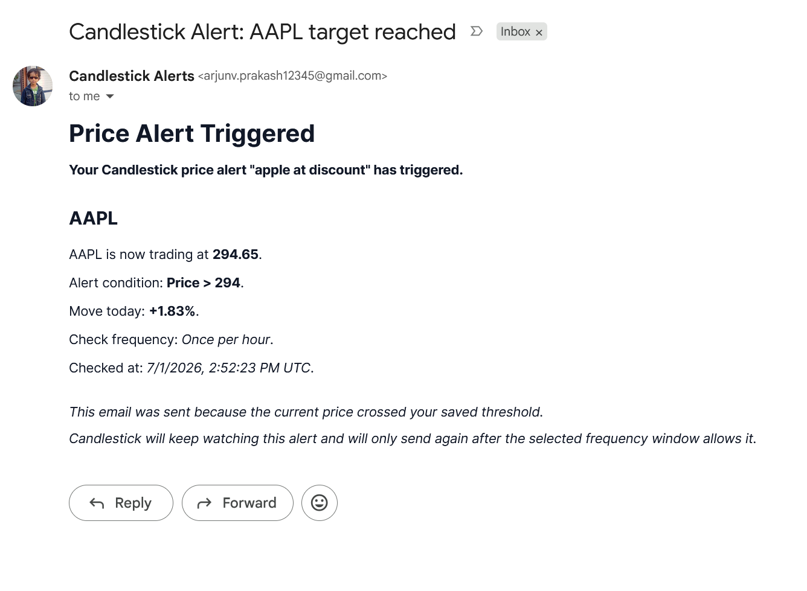
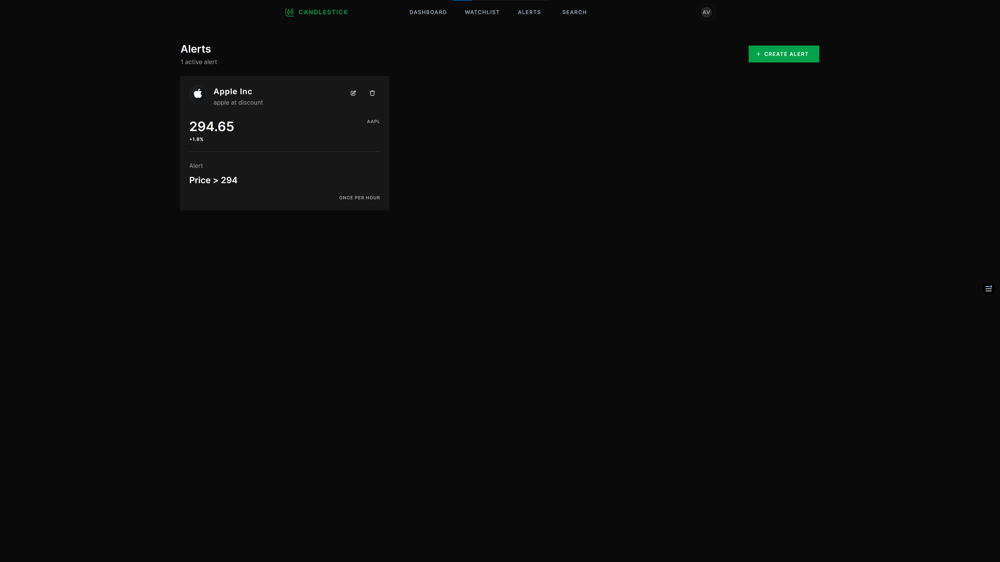
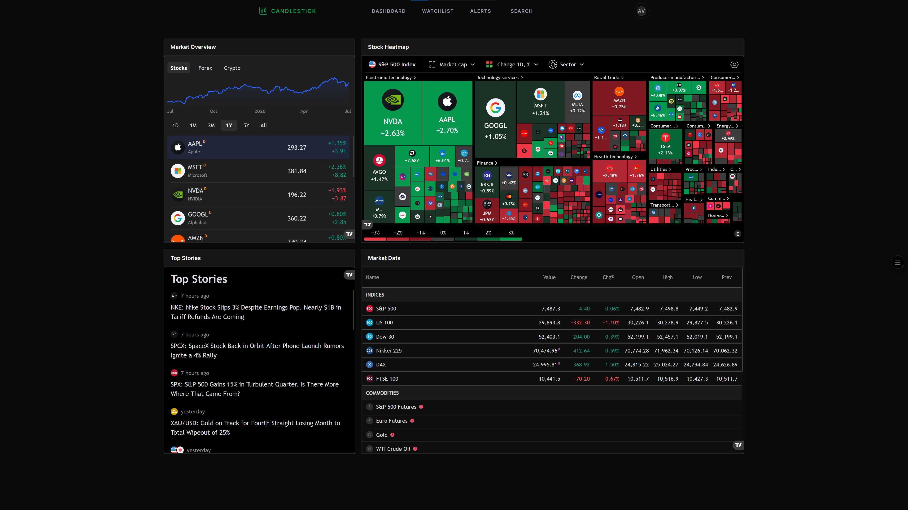
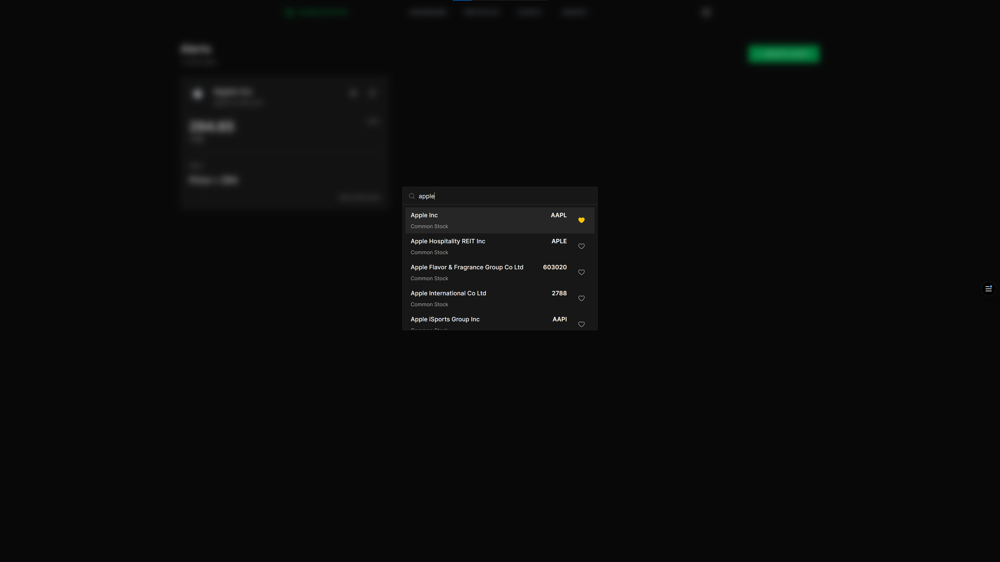
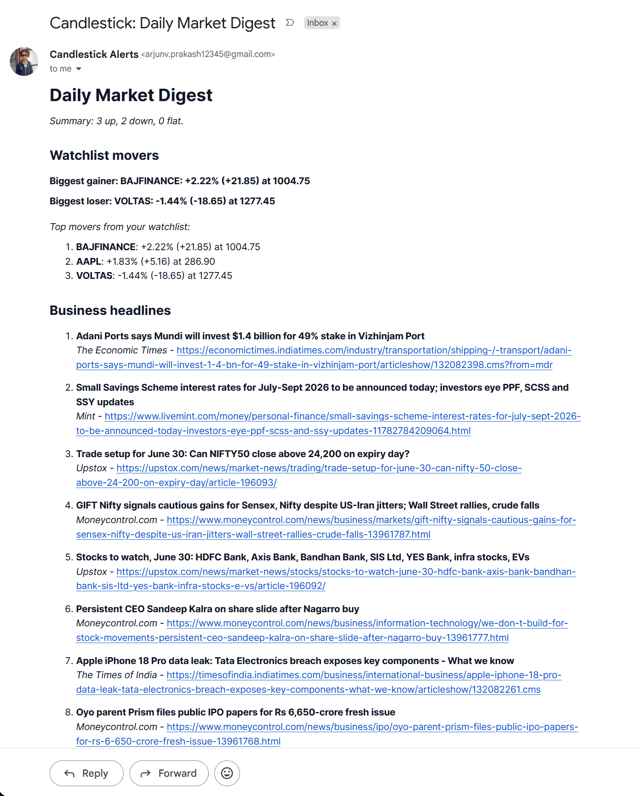
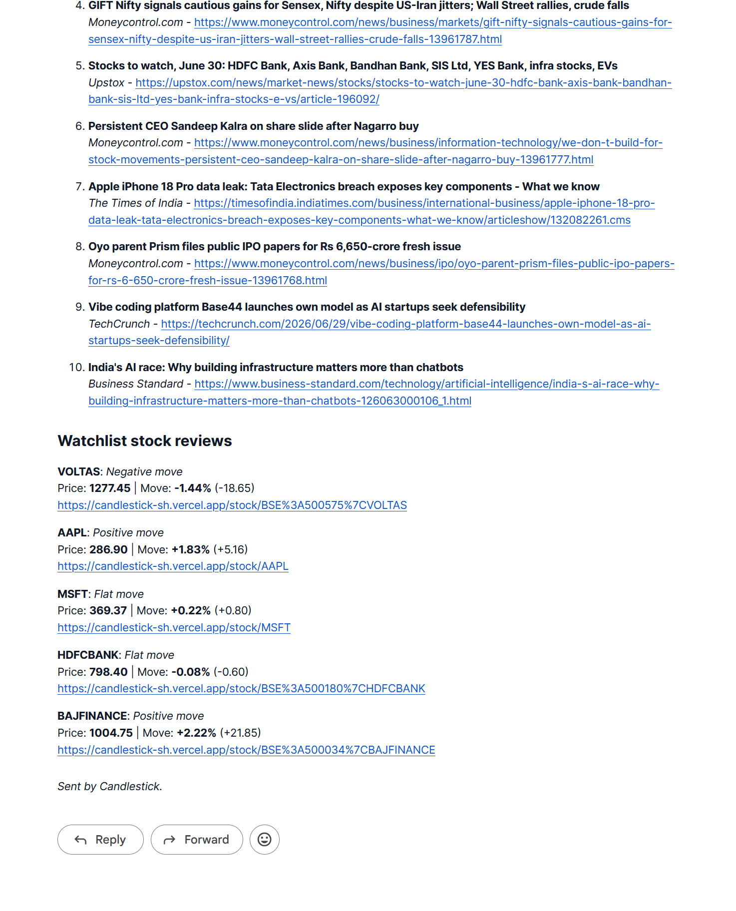
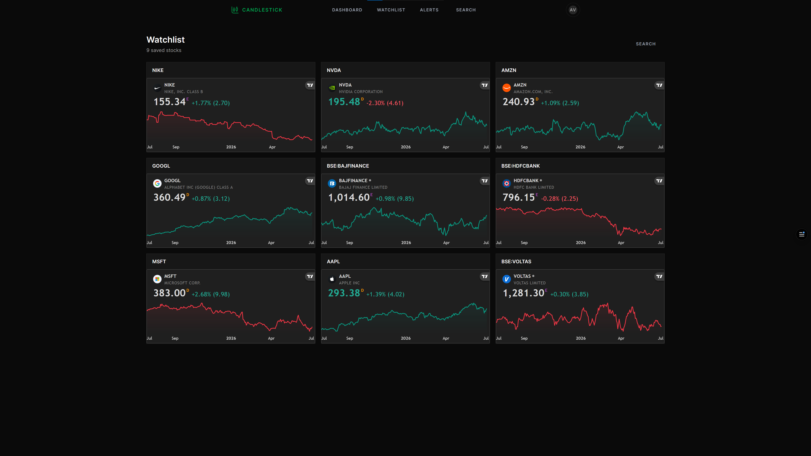

# candlestick

## overview

candlestick is an ai-powered stock market app with watchlists, alerts, and daily digest emails.

## what it does

the dashboard gives you charts, stock data, and ai-backed context. search for a stock, open its page, and check the chart, company profile, fundamentals, and technical analysis.

## main flow

search -> review the stock -> save it -> track it later.

## watchlists and alerts

watchlists keep the stocks you care about close. alerts let you set a price target and get an email when the stock crosses it. daily digest emails help you stay updated.

## image showcase

| | |
| --- | --- |
|  alert email |  alerts |
|  dashboard |  search |
|  daily digest email |  daily digest details |
|  watchlist |  |
